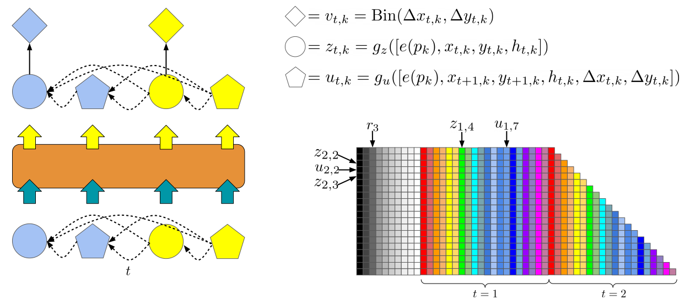
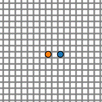
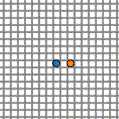
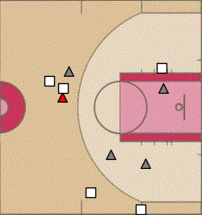

# <code>baller2vec++</code>

This is the repository for the paper:

>[Michael A. Alcorn](https://sites.google.com/view/michaelaalcorn) and [Anh Nguyen](http://anhnguyen.me). [`baller2vec++`: A Look-Ahead Multi-Entity Transformer For Modeling Coordinated Agents](https://arxiv.org/abs/2104.11980). arXiv. 2021.

|  |
|:--|
| To learn statistically dependent agent trajectories, <code>baller2vec++</code> uses a specially designed self-attention mask to simultaneously process three different sets of features vectors in a single Transformer. The three sets of feature vectors consist of location feature vectors like those found in <code>baller2vec</code>, look-ahead trajectory feature vectors, and starting location feature vectors. This design allows the model to integrate information about *concurrent* agent trajectories through *multiple* Transformer layers without seeing the future (in contrast to <code>baller2vec</code>). |

|  |  |  |
|:--:|:--:|:--:|
| Training sample | <code>baller2vec</code> | <code>baller2vec++</code> |

When trained on a dataset of perfectly coordinated agent trajectories,  the trajectories generated by <code>baller2vec</code> are completely *uncoordinated* while the trajectories generated by <code>baller2vec++</code> are perfectly coordinated.

|  |  |  |  |
|:--:|:--:|:--:|:--:|
| Ground truth | <code>baller2vec</code> | <code>baller2vec</code> | <code>baller2vec</code> |
|  |  |  |  |
| Ground truth | <code>baller2vec++</code> | <code>baller2vec++</code> | <code>baller2vec++</code> |

While <code>baller2vec</code> occasionally generates realistic trajectories for the red defender, it also makes egregious errors.
In contrast, the trajectories generated by <code>baller2vec++</code> often seem plausible.
The red player was placed *last* in the player order when generating his trajectory with <code>baller2vec++</code>.

## Citation

If you use this code for your own research, please cite:

```
@article{alcorn2021baller2vec,
   title={\texttt{baller2vec++}: A Look-Ahead Multi-Entity Transformer For Modeling Coordinated Agents},
   author={Alcorn, Michael A. and Nguyen, Anh},
   journal={arXiv preprint arXiv:2104.11980},
   year={2021}
}
```

## Training <code>baller2vec++</code>

### Setting up `.basketball_profile`

After you've cloned the repository to your desired location, create a file called `.basketball_profile` in your home directory:

```bash
nano ~/.basketball_profile
```

and copy and paste in the contents of [`.basketball_profile`](.basketball_profile), replacing each of the variable values with paths relevant to your environment.
Next, add the following line to the end of your `~/.bashrc`:

```bash
source ~/.basketball_profile
```

and either log out and log back in again or run:

```bash
source ~/.bashrc
```

You should now be able to copy and paste all of the commands in the various instructions sections.
For example:

```bash
echo ${PROJECT_DIR}
```

should print the path you set for `PROJECT_DIR` in `.basketball_profile`.

### Installing the necessary Python packages

```bash
cd ${PROJECT_DIR}
pip3 install --upgrade -r requirements.txt
```

### Organizing the play-by-play and tracking data

1) Copy `events.zip` (which I acquired from [here](https://github.com/sealneaward/nba-movement-data/tree/master/data/events) \[mirror [here](https://github.com/airalcorn2/nba-movement-data/tree/master/data/events)\] using https://downgit.github.io) to the `DATA_DIR` directory and unzip it:

```bash
mkdir -p ${DATA_DIR}
cp ${PROJECT_DIR}/events.zip ${DATA_DIR}
cd ${DATA_DIR}
unzip -q events.zip
rm events.zip
```

Descriptions for the various `EVENTMSGTYPE`s can be found [here](https://github.com/rd11490/NBA_Tutorials/tree/master/analyze_play_by_play) (mirror [here](https://github.com/airalcorn2/NBA_Tutorials/tree/master/analyze_play_by_play)).

2) Clone the tracking data from [here](https://github.com/linouk23/NBA-Player-Movements) (mirror [here](https://github.com/airalcorn2/NBA-Player-Movements)) to the `DATA_DIR` directory:

```bash
cd ${DATA_DIR}
git clone git@github.com:linouk23/NBA-Player-Movements.git
```

A description of the tracking data can be found [here](https://danvatterott.com/blog/2016/06/16/creating-videos-of-nba-action-with-sportsvu-data/).

### Generating the training data

```bash
cd ${PROJECT_DIR}
nohup python3 generate_game_numpy_arrays.py > data.log &
```

You can monitor its progress with:

```bash
top
```

or:

```bash
ls -U ${GAMES_DIR} | wc -l
```

There should be 1,262 NumPy arrays (corresponding to 631 X/y pairs) when finished.

### Running the training script

Run (or copy and paste) the following script, editing the variables as appropriate.

```bash
#!/usr/bin/env bash

JOB=$(date +%Y%m%d%H%M%S)

echo "train:" >> ${JOB}.yaml
task=basketball  # "basketball" or "toy".
echo "  task: ${task}" >> ${JOB}.yaml
if [[ "$task" = "basketball" ]]
then

    echo "  train_valid_prop: 0.95" >> ${JOB}.yaml
    echo "  train_prop: 0.95" >> ${JOB}.yaml
    echo "  train_samples_per_epoch: 20000" >> ${JOB}.yaml
    echo "  valid_samples: 1000" >> ${JOB}.yaml
    echo "  workers: 10" >> ${JOB}.yaml
    echo "  learning_rate: 1.0e-5" >> ${JOB}.yaml
    echo "  patience: 20" >> ${JOB}.yaml

    echo "dataset:" >> ${JOB}.yaml
    echo "  hz: 5" >> ${JOB}.yaml
    echo "  secs: 4.2" >> ${JOB}.yaml
    echo "  player_traj_n: 11" >> ${JOB}.yaml
    echo "  max_player_move: 4.5" >> ${JOB}.yaml

    echo "model:" >> ${JOB}.yaml
    echo "  embedding_dim: 20" >> ${JOB}.yaml
    echo "  sigmoid: none" >> ${JOB}.yaml
    echo "  mlp_layers: [128, 256, 512]" >> ${JOB}.yaml
    echo "  nhead: 8" >> ${JOB}.yaml
    echo "  dim_feedforward: 2048" >> ${JOB}.yaml
    echo "  num_layers: 6" >> ${JOB}.yaml
    echo "  dropout: 0.0" >> ${JOB}.yaml
    echo "  b2v: False" >> ${JOB}.yaml

else

    echo "  workers: 10" >> ${JOB}.yaml
    echo "  learning_rate: 1.0e-4" >> ${JOB}.yaml

    echo "model:" >> ${JOB}.yaml
    echo "  embedding_dim: 20" >> ${JOB}.yaml
    echo "  sigmoid: none" >> ${JOB}.yaml
    echo "  mlp_layers: [64, 128]" >> ${JOB}.yaml
    echo "  nhead: 4" >> ${JOB}.yaml
    echo "  dim_feedforward: 512" >> ${JOB}.yaml
    echo "  num_layers: 2" >> ${JOB}.yaml
    echo "  dropout: 0.0" >> ${JOB}.yaml
    echo "  b2v: True" >> ${JOB}.yaml

fi

# Save experiment settings.
mkdir -p ${EXPERIMENTS_DIR}/${JOB}
mv ${JOB}.yaml ${EXPERIMENTS_DIR}/${JOB}/

gpu=0
cd ${PROJECT_DIR}
nohup python3 train_baller2vecplusplus.py ${JOB} ${gpu} > ${EXPERIMENTS_DIR}/${JOB}/train.log &
```
